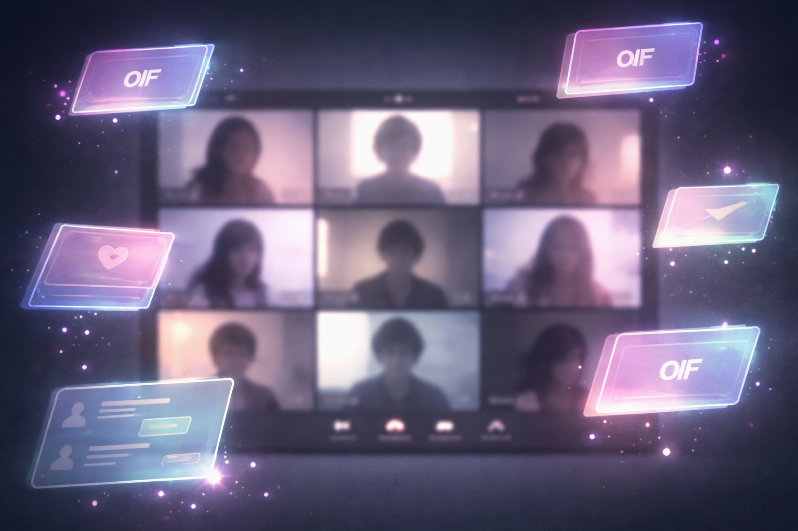
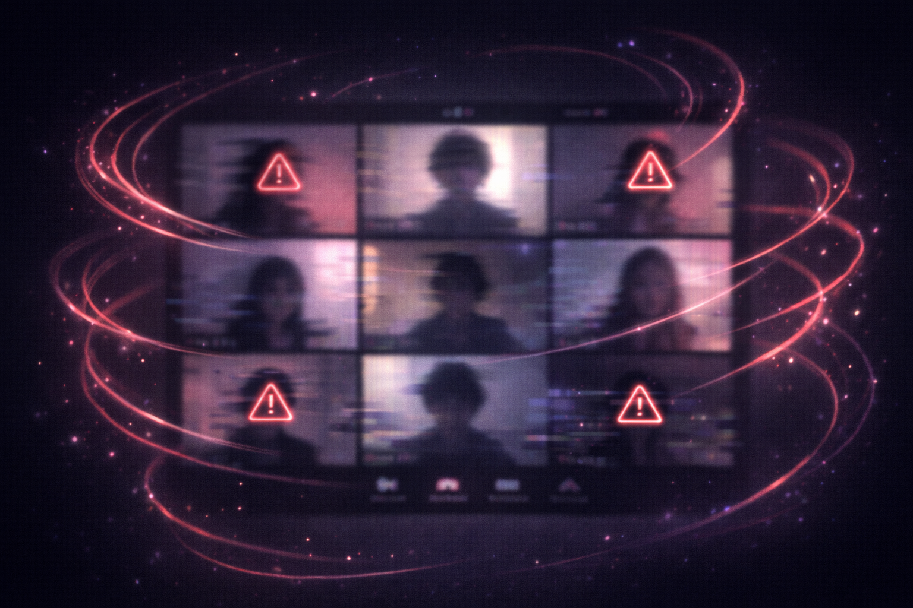
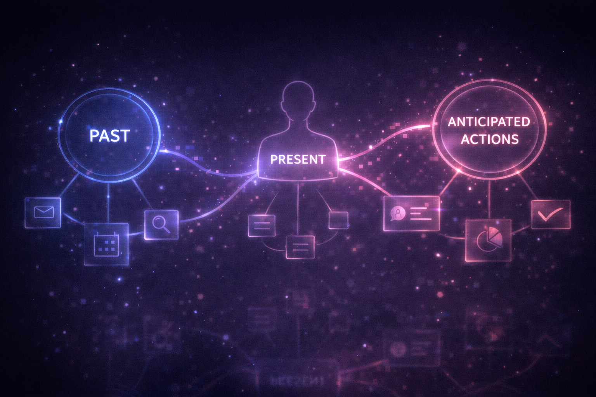
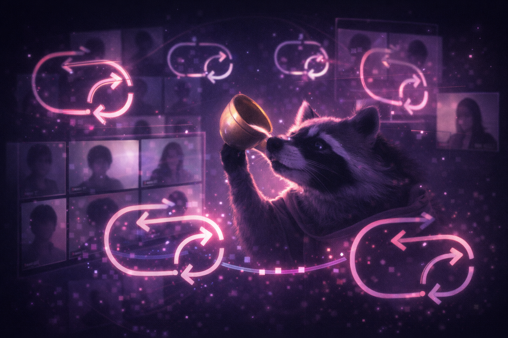

# Zoom 49: Distributed Digital Complexity in Postmodern Narrative

**Authors:** Complexity into Clarity Team  
**Date:** 2026  

---

## Abstract
*Zoom 49* is a serialized postmodern narrative modeling distributed digital collaboration under uncertainty. Across seven weeks, a fictional team navigates chaos, recursion, stress, meta-awareness, and emergent complexity within Zoom, Slack, and AI-mediated workflows. The study explores how absurdity, play, and symbolic motifs contribute to emergent insight, distributed cognition, and systemic stability — drawing on postmodern literature (Pynchon, 1966), distributed cognition theory (Hutchins, 1995), and complexity theory (Mitchell, 2009).

**Keywords:** Zoom 49, postmodern narrative, recursive systems, distributed cognition, complexity, meta-awareness, absurdity, play

---

## Table of Contents

1. [Introduction](#introduction)  
2. [Conceptual Framework](#conceptual-framework)  
   - Postmodern Narrative  
   - Distributed Cognition  
   - Complexity Theory  
3. [Methods / Narrative Structure](#methods--narrative-structure)  
4. [Weekly Serialized Narrative](#weekly-serialized-narrative)  
5. [Recurring Motifs and Semiotic Analysis](#recurring-motifs-and-semiotic-analysis)  
6. [Discussion](#discussion)  
7. [Visual Prompt Guidelines](#visual-prompt-guidelines)  
8. [Conclusion](#conclusion)  
9. [References](#references)  
10. [Appendices](#appendices)  

---

## Introduction
Digital collaboration is increasingly complex, asynchronous, and multi-modal. *Zoom 49* investigates these conditions through fictional storytelling combined with academic analysis, creating a hybrid research framework.  

Goals:  
1. Examine emergent behaviors in complex digital systems  
2. Explore recursion, absurdity, and symbolic insight  
3. Map distributed cognition in collaborative environments  

---

## Conceptual Framework

### Postmodern Narrative
Inspired by Pynchon (1966): hidden networks, paranoia, pattern recognition. Narrative elements encode insights about distributed collaboration.

### Distributed Cognition
Hutchins (1995): cognition distributed across people and artifacts. In Zoom 49: Slack threads, Zoom tiles, emojis, and slides function as cognitive extensions.

### Complexity Theory
Mitchell (2009): emergent behavior arises in adaptive systems. Zoom 49 demonstrates self-organization, feedback loops, and non-linear causality.

---

## Methods / Narrative Structure
- **Data Type:** Serialized fictional narrative (Weeks 1–7)  
- **Units of Analysis:** Daily interactions, team members, AI/phantom participants  
- **Analytical Lens:** Pattern recognition, recursion, symbolic interpretation  
- **Visual Figures:** Placeholders included for future generation  

---

## Weekly Serialized Narrative

### Week 1 – The Digital Tristero (Chaos)
- **Key Events:** Notifications, dancing llama GIFs, horn signals, accidental problem-solving  
  
- **Character Arcs:** Oedi (observer), Sergio (stability), Milo (play)  

### Week 2 – The Recursive Signal
- **Key Events:** Dot participant, Slack anomalies, repeated patterns  
  
- **Character Arcs:** Oedi (pattern recognition), Milo (playful reflection)  

### Week 3 – The Stress Test
- **Key Events:** Predicted failures, emotional stress, adaptive recovery  
  
- **Character Arcs:** Oedi (decision anchor), Milo (modulated play)  

### Week 4 – The Meta Turn
- **Key Events:** Phantom Observer_X, AI/phantom dots, recursive communication  
  
- **Character Arcs:** Oedi (meta-awareness), Sergio (multi-layered stability)  

### Week 5 – Phantom Protocols
- **Key Events:** AI participants, predictive loops, horn as awareness tool  
  
- **Character Arcs:** Oedi (co-creator), Milo (playful insight)  

### Week 6 – Predictive Play
- **Key Events:** Anticipated glitches, horn as syntax, Tristero mapping  
  
- **Character Arcs:** Oedi (strategic participant), Milo (play as generative strategy)  

### Week 7 – The Tristero Revealed
- **Key Events:** Meta-resolution, motifs converge, closure without closure  
  
- **Character Arcs:** Oedi (co-author), Sergio (living protocol), Milo (playful insight)  

---

## Recurring Motifs and Semiotic Analysis

| Motif | Meaning | Week Introduced |
|-------|---------|----------------|
| Horn | Awareness, rhythm, insight | 1 |
| Dot | Presence, anchor, observation | 2 |
| Raccoon GIFs | Playful reflection, system feedback | 1 |
| Phantom/AI participants | Recursion, meta-observation | 4 |
| Slides & Screens | Visual mapping of complexity | 1 |
| #lot-49 Slack | Hidden channels, emergent communication | 2 |

*Annotation:* Motifs act as semiotic markers enabling participants (and readers) to interpret emergent patterns.

---

## Discussion
- **Emergent Clarity:** Absurdity and play facilitate pattern recognition.  
- **Recursive Agency:** Team members act as both observers and contributors.  
- **Meta-Awareness:** Recursive loops, AI proxies, and phantom participants illustrate feedback and adaptation.  
- **Distributed Cognition:** Artifacts externalize cognitive processes, producing emergent solutions.

---

## Visual Prompt Guidelines
- **Figure 1:** Blurred Zoom gallery + GIF overlays  
- **Figure 2:** Looped slides + bullet point echoes  
- **Figure 3:** Lagging tiles + warnings + spirals  
- **Figure 4:** Fractal grid + ghost tiles + phantom dots  
- **Figure 5:** AI icons + GIF interactions  
- **Figure 6:** Recursive network diagrams  
- **Figure 7:** Overlay of tiles + raccoon tipping horn  

---

## Conclusion
- Chaos is generative, not disruptive.  
- Absurdity and play functionally support insight.  
- Recursive awareness allows co-creation of complex systems.  
- Emergent clarity arises when observation, play, and reflection converge.  

---

## References (APA)
Hutchins, E. (1995). *Cognition in the wild*. MIT Press.  

Mitchell, M. (2009). *Complexity: A guided tour*. Oxford University Press.  

Pynchon, T. (1966). *The Crying of Lot 49*. J.B. Lippincott & Co.  

---

## Appendices

### Appendix A – Character Arcs

| Character | Week 1 | Week 4 | Week 7 |
|-----------|--------|--------|--------|
| Oedi | Observer | Meta-awareness | Co-author, strategic participant |
| Sergio | Stability | Anchoring in recursion | Living protocol |
| Milo | Playful insight | Creative play | Play as generative insight |
| Bianca | Guidance | Reflection | Integrator of reflection & action |
| Lena | Cryptic | Strategic ambiguity | Scaffold for emergent insight |
| Felix | Opaque work | Connective tissue | Systemic leverage |
| Piper | Documentation | Archivist | Meta-memory & reflection |
| Max | Disruption | Visual mapping | Predictive visual clarity |

### Appendix B – Figures / Visual Prompts
- **Figure 1:** Blurred Zoom gallery + dancing GIFs/rectangles  
- **Figure 2:** Multi-layered repeated slides  
- **Figure 3:** Lagging tiles + warnings + spirals  
- **Figure 4:** Fractal grid + ghost tiles  
- **Figure 5:** AI icons + GIF interactions  
- **Figure 6:** Recursive network diagrams  
- **Figure 7:** Overlay of tiles + raccoon tipping horn  

---